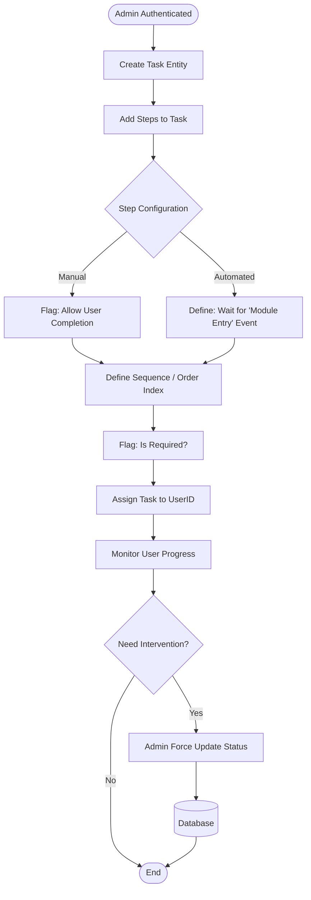
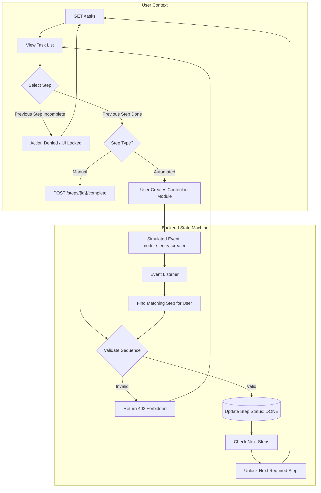

# Instructions

Please stick to the following instructions on how to submit your application:

1. Read the **whole** README
2. Create a new repository on your Github Account. *Note: The repository has to be public.*
3. Add your solution **with all requirements** to your repository
4. Send a mail to [application@innoloft.com](mailto:application@innoloft.com) with following information:
   - Your Name
   - Link to **public** accessible repository on **GitHub**
   - How many hours it took to complete (roughly)

**Please do not spend much more than 6 hours for the whole task.** This is not a hard limitation but want to respect your time since we cannot hire every applicant. Also only start with the task if you think this is something you can do in the given time frame.

### Additional Information to submit a successful application

- Make sure that your repository is public
- Only an application with [all requirements](https://github.com/innoloft/Backend-Application#technical-requirements) can be considered
- Provide setup process if required
- Copied structures or code from other applications will be completely ignored

Thank you very much and have fun with the challenge!

# Challenge

## Context and Objective

### General: LoftOS

LoftOS is a B2B no-code platform that empowers organizations to launch their own web applications — ranging from innovation marketplaces to procurement hubs — without writing a single line of code. Our architecture is completely modular. Modules (Offers, Chat, Matchmaking) are composed of various microservices that interact via an event bus.

### Problem: User onboarding and task management

When an organization launches a new LoftOS platform, end-users often face a "cold start" problem. They enter a complex system and are unsure of their first steps (e.g., "Should I fill out my profile first?" or "Where can I post a new job listing?").

### Solution: User tasks module

To solve this, we are introducing the User Tasks Module. This is an onboarding and compliance engine that allows Platform Admins to define rigid, linear workflows for their users.

The goal is to implement the microservice for this module. You need to create API endpoints, database schema, and business logic to manage Tasks and Steps, enforce sequential dependencies, and handle both manual user actions and automated events.

## Technical Scope

### Domain Entities

* **Task:** The parent container. Attributes: Title, Description, Icon, Assigned User ID, Overall Status (OPEN/DONE).
* **Step:** The atomic unit of work. Attributes: Title, Description, Icon, Status (OPEN/DONE), Order Index.
* **Configuration:** Steps can be `Manual` (user checks a box) or `Automated` (triggered by an external system event).
* **Dependency:** Steps can be marked as `Required`. A step cannot be started or completed until all preceding `Required` steps are `DONE`.

### Functional Requirements

#### A. Admin Capabilities (Management)

* **CRUD Operations:** Create, Read, Update, and Delete Tasks and Steps.
* **Assignment:** Assign a Task to a specific `user_id`.
* **Force State:** Admins must be able to overwrite the status of any Step or Task to `DONE` or `OPEN` regardless of constraints (Emergency Override).

#### B. User Capabilities (Execution)

* **Read Access:** Fetch assigned tasks with their current state. Locked steps (where dependencies are not met) must be distinguishable in the response payload.
* **Manual Completion:** An endpoint to mark a specific Manual Step as `DONE`. This must fail if preceding required steps are incomplete.

#### C. System Logic (Event Handling)

* **Automated Completion:** The service must simulate a message consumer that listens for a `module_entry_created` event.
* **Logic:** When the event is received, find the corresponding active Step for that User and Module, mark it as `DONE`, and unlock subsequent steps.

### Technical Constraints & Expectations

* **Database:** Use a relational database (MySQL recommended) to enforce foreign keys and integrity.
* **Architecture:** RESTful API
* **Logic:** The "Linear Sequence" logic is the core complexity. The system must validate order before allowing state transitions.
* **Mocking:** Since the "Content Service" does not exist in the test environment, the candidate should create a mock endpoint or script to trigger the `module_entry_created` event payload.

## Workflows

### Diagram A: Admin Workflow (Definition & Management)

This flow focuses on the creation of the structure and the override capabilities required for administrative control.

### Diagram B: User & System Workflow (Execution & State Machine)

This flow focuses on the end-user experience and the backend state machine logic that processes dependencies and external events.

## Mockups

Note: The mockups are only for reference and to give you an idea of the expected API responses. You do not have to implement the frontend, only the API endpoints that would enable the frontend to work.

### Task Listing (User View)

### Steps Listing (User View)

## Clarification

- You **do not** have to build the frontend. Only the API requests that would enable the frontend to work.
- Top navigation, menu on the left, etc. are not part of this task. This is only about the tasks module.

# Technical Requirements

- For API design follow REST style
- Project
  - [ASP.NET Core web API application](https://docs.microsoft.com/en-us/aspnet/core/tutorials/first-web-api?view=aspnetcore-3.1&tabs=visual-studio). Prefer version 6.
- Database
  - Use SQLite or MySQL (**Do not use Microsoft SQL or SQL Express**). Please add setup instructions if necessary
  - Use EF Core ORM framework to work with database
- Tests project
  - At least one unit test should be written (even the simplest one)
- Project should be setup to run as a docker container - `Dockerfile` is required